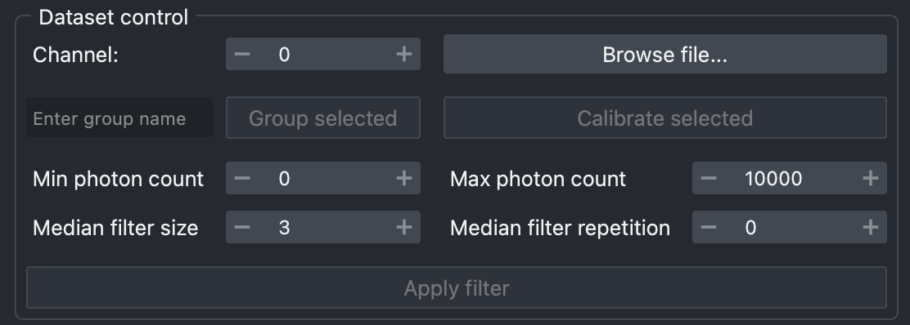
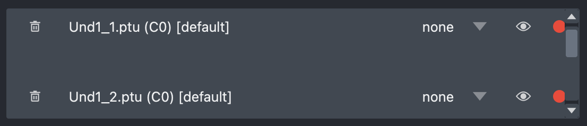
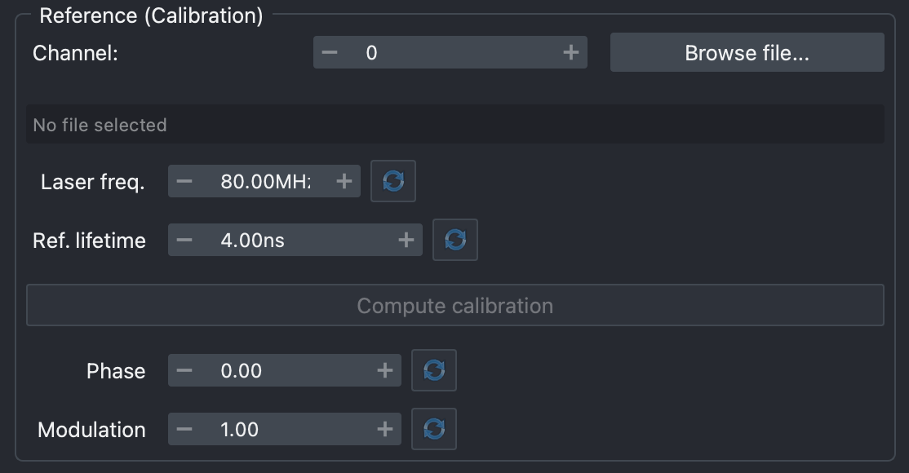
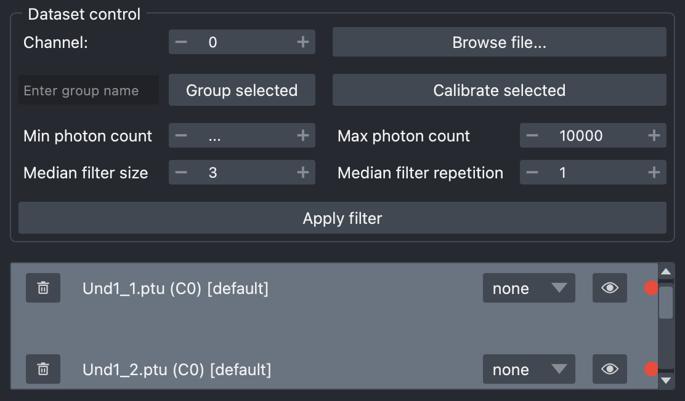

# Tutorials

Two example FLIM images, along with a reference image for phasor calibration, are provided alongside FLIMari. The two examples provided are IMSPECTOR TIFF and PicoQuant PTU, but the following tutorials are agnostic to user image formats.

## Import FLIM Data

FLIM files can be imported using the **Browse file...** button under the the *Dataset control* section in the FLIMari main panel.

/// caption
Dataset control GUI
///

Files are selected through the native OS file manager dialog. Multiple files with different formats may be selected and imported at once. There is no upper limit to the number of files that can be imported at once, but loading many files may take a long time.

!!!note
    Only one channel is loaded at once for all selected files. If you want to analyze multiple channels in the same FLIM file, you can load the file multiple times, each time with a different channel specified.
    
    FLIMari channels are zero-based, meaning channel 0 is the first channel. 

## Manage FLIM Data

/// caption
Dataset list GUI
///

Each item in the dataset list corresponds to an imported FLIM file. It is made of several interactable UI components:

* **Delete button**: Remove the dataset item and associated FLIM data.
* **Dataset name**: Formatted as `file_name(channel)[group_name]`.
* **Display mode**: How to display the FLIM data in the viewer. See (TODO) for more information.
* **Focus button**: Hide all other images in the viewer.
* **Status indicator**: Whether this dataset has been calibrated. 
    * Red = uncalibrated
    * Green = calibrated
    * Yellow = calibration parameters have changed

Items in the list can be freely selected and deselected using `SHIFT+LEFT MOUSE CLICK` and `CTRL+LEFT MOUSE CLICK`. Most FLIMari operations on datasets only affect selected datasets in the list.

## Prepare Calibration

For accurate Phasor analysis of FLIM data, one must account for the effect of the [Instrument Response Function](https://www.tcspc.com/doku.php/howto:how_to_work_with_the_instrument_response_function_irf) (IRF).

FLIMari implements IRF correction using the **reference signal**. The reference signal is a FLIM file containing a sample with a known mono-exponential lifetime, acquired using the same microscope device and condition as the biological samples.

To calibrate FLIM data against a reference signal, first import the reference FLIM file in the calibration GUI.

/// caption
Calibration GUI
///

Calibration import accepts the same file formats as regular FLIM data. Likewise, it imports only the selected channel.

Once loaded, FLIMari will attempt to fetch the laser frequency from the file metadata. If successful, the `Laser freq.` input field will be set to the found value and turn green; otherwise, the value will need to be entered manually. `Ref. lifetime`, i.e. the fluorescence lifetime of the reference lifetime species, usually cannot be populated automatically and must be entered manually. 

After both `Laser freq.` and `Ref. lifetime` are set, press the **Compute calibration** button to calculate the calibration parameters `Phase` and `Modulation`. If successful, the input fields will be set to the calculated value and turn green. 

/// caption
Successfully computed calibration
///

!!!tip
    All automatically set values in the Calibration GUI can be manually overridden. Manually set fields will turn blue. Press the **Reset** button next to the input field to reset its value to the previously automatically set value.

## Calibrate Datasets

To calibrate datasets, simply select them in the [dataset list](tutorials.md#manage-flim-data), then press the **Calibrate selected** button. The indicator lights will turn green once the calibration completes.

/// caption
Calibrate datasets
///

!!!warning
    Calibration may succeed even if no reference file has been loaded. Such calibration uses the default `Phase=0` and `Modulation=1`, meaning the phasor coordinates are unchanged. If your calibrated datasets do not behave as expected, check whether they have been actually calibrated against the reference.

!!!tip
    Calibration parameters `Phase` and `Modulation` can be verified by importing the reference FLIM file as a regulat dataset, then calibrate it and confirm its phasor cloud centers on the universal semi-circle, at the correct lifetime position.

## Apply Filters

FLIM data often contains background pixels and pixels with low total photon counts. These pixels should not be included in FLIM analysis since they do not represent biological samples or are too noisy for any meaningful work. While the Phasor approach requires much fewer photon counts than fitting a parametric model, 25 to 30 photons are still required for accurate phasor coordinates.

FLIMari offers two simple but effective filters: photon thresholding and the median filter. These two filters are applied sequentially, with the median filter being applied first and photon thresholding last.

/// caption
Input fields for filter adjustments
///

The median filter is applied to both real and imaginary phasor coordinates independently. The filter kernel size and strength can be adjusted in the *Dataset control* section by changing the values of `Median filter size` and `Median filter repetition`. For a detailed explanation on how these parameters affect the behaviour of the median filter, please refer to the [numpy documentation](https://numpy.org/doc/stable/reference/generated/numpy.nanmedian.html).

Photon thresholding is applied once to both real and imaginary phasor coordinates after the median filter. The thresholding is always based on the total photon counts in the original data, i.e., median filter has no effect on which pixel to be excluded. 

The minimum and maximum photon threshold can be set in the *Dataset control* section by changing the values of `Min photon count` and `Max photon count`. Any pixel with a total photon count outside the specified range will be discarded during both visualization and analysis. 

!!!tip
    You can determine the optimal photon count threshold using napari's built-in colorbar.

    Make sure the dataset is in the `none` display mode (so that the image viewer shows the photon counts), then head to the napari layer list and right-click on the dataset, then select **Visualization -> colorbar**. Alternatively, you can also hover over the image to see the photon count of the pixel under the cursor.

Filters are only applied/updated when the **Apply filter** button is pressed, and only apply to selected datasets. Both the original data and filtered data are stored, so you may re-apply the filters any number of times without reloading the imported data manually.

!!!Note
    Datasets store their last used filter parameters. You can select a dataset to view its filter parameters in the *Dataset control* GUI.

    If multiple datasets are selected and their filter parameters value differ, `...` will be shown in the GUI, indicating the selected datasets contain different values. You may still override this value and apply filters to all selected datasets using a common set of parameters, as normal.

## Visualize Phasor

To visualize the phasor coordinates of datasets, select them in the dataset list, then press the **Visualize Phasor** button. This opens the Phasor Plot widget with the selected datasets.

/// caption
The Phasor Plot widget
///

TODO

## ROI Analysis

TODO

## UMAP Analysis

TODO

### UMAP Embeddings

TODO

### Clustering

TODO

## Summarize Datasets

TODO